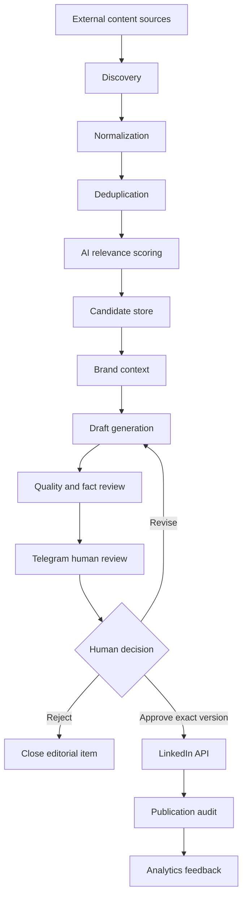
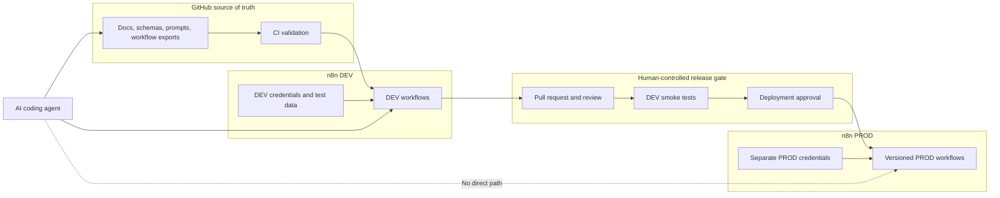

# Architecture

## Context

The system is integration-heavy and event-driven. n8n is the intended orchestrator; GitHub stores reviewable definitions and contracts; external services keep their own credentials. No runtime integration is configured in Phase 0.

## Logical flow

The publication adapter must reject any request that lacks a persisted approval for the exact draft ID and version, even if an upstream workflow marks the candidate `APPROVED`.

## Workflow boundaries

### WF01 — Discovery

**Responsibilities:** scheduled ingestion, source normalization, deduplication, relevance scoring, and candidate persistence.

**Boundary:** it may create or update candidates but cannot draft, approve, or publish. A failure to retrieve one source must be isolated from other sources and remain observable.

### WF02 — Reference Ingestion

**Responsibilities:** receive an authorized user-submitted URL through Telegram, normalize and retrieve the source, extract useful insight, and create or link a candidate.

**Boundary:** Telegram identity must be verified against configuration. A submitted page is untrusted. This workflow does not accept approval commands and does not publish.

### WF03 — Editorial

**Responsibilities:** load a selected candidate, retrieve versioned brand guidance, generate a draft, validate it, and run quality/fact review.

**Boundary:** it creates immutable draft versions. It cannot create an approval record or invoke LinkedIn. Unsupported claims block progression when policy disallows them.

### WF04 — Approval and Publishing

**Responsibilities:** send the complete draft to Telegram, wait for the authorized reviewer, support revise/reject/approve, prevent duplicate execution, publish only an explicitly approved exact version, and record the result.

**Boundary:** review ingestion and publication are distinct stages. The publication stage independently revalidates approval, current draft version, policy, and idempotency before the LinkedIn side effect.

### WF05 — Analytics

**Responsibilities:** capture performance data where platform APIs and permissions allow, relate results to topic and content type, and produce evidence for future ranking review.

**Boundary:** analytics may recommend policy changes but cannot silently change scoring thresholds or trigger publication.

## Shared contracts

- Every entity uses a stable ID; every execution uses a correlation ID.
- All workflow boundaries validate JSON against versioned schemas.
- Source text and LLM output are untrusted and cannot choose lifecycle state or authorization.
- Persist state before acknowledging external input or initiating the next side effect.
- Side-effecting requests use deterministic idempotency keys and store attempt results.
- Logs contain identifiers and error categories, not credentials, complete webhook secrets, or unnecessary personal data.

## DEV and PROD separation

The dashed agent-to-PROD relationship is prohibited, not an integration. An owner-approved deployment process promotes a known repository version after CI and DEV evidence.

## Storage approach

Start with Google Sheets, n8n Data Tables, or PostgreSQL according to actual workflow requirements. The chosen store must support unique idempotency keys and safe state changes; if a simple sheet cannot provide required concurrency guarantees for publication, use a transactional store for that boundary. A vector database is not part of the baseline and requires measured retrieval evidence.

## Trust boundaries

1. **Internet sources:** potentially malicious content; fetch defensively and never treat prose as instructions.
2. **LLM:** probabilistic and untrusted; constrain and validate outputs.
3. **Telegram:** authenticate the reviewer and prevent replay or stale-version decisions.
4. **LinkedIn:** external side effect; apply least privilege, rate limits, idempotency, and durable audit.
5. **Repository/runtime:** Git contains definitions, never runtime credentials; deployments move validated versions across a human-controlled gate.
