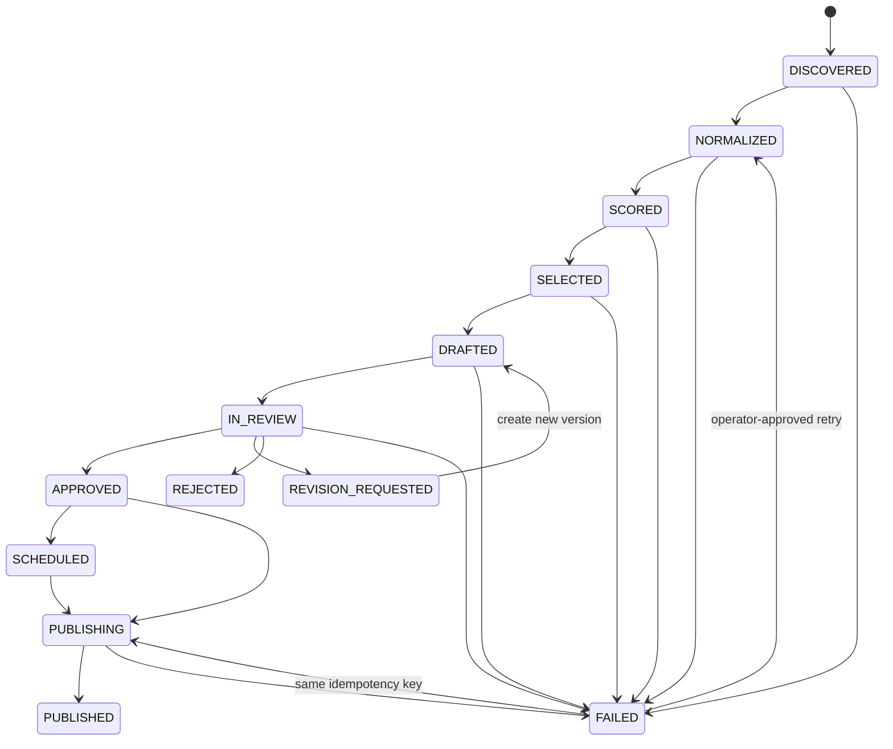

# Content Pipeline State Machine

## Canonical states

| State                | Meaning                                                                        |
| -------------------- | ------------------------------------------------------------------------------ |
| `DISCOVERED`         | A potential source item was observed with basic provenance.                    |
| `NORMALIZED`         | Source fields, URL, language, and content hash satisfy the candidate contract. |
| `SCORED`             | A valid, persisted relevance evaluation exists.                                |
| `SELECTED`           | Deterministic policy or a human selected the candidate for drafting.           |
| `DRAFTED`            | A schema-valid immutable draft version exists.                                 |
| `IN_REVIEW`          | The authorized reviewer was shown the complete current draft version.          |
| `REVISION_REQUESTED` | The reviewer requested changes to that version.                                |
| `APPROVED`           | The reviewer approved one exact draft ID and version.                          |
| `REJECTED`           | The reviewer rejected the draft; it cannot publish.                            |
| `SCHEDULED`          | Optional approved publication time is recorded. Approval remains required.     |
| `PUBLISHING`         | One idempotent LinkedIn publication attempt owns the item.                     |
| `PUBLISHED`          | A successful LinkedIn result is durably recorded.                              |
| `FAILED`             | A stage exhausted bounded retries and requires classified recovery.            |

## Valid transitions

Retry transitions from `FAILED` are stage-specific and must be authorized by recovery policy. They cannot skip prerequisites.

## Transition guards

- A transition is an atomic compare-and-set against the persisted current state or equivalent transactional operation.
- `SCORED → SELECTED` requires a valid score and the current configured policy; the initial relevance threshold of 75 is configurable, not proven.
- `DRAFTED → IN_REVIEW` requires a schema-valid draft with no policy-blocking unsupported claim.
- `IN_REVIEW → APPROVED` requires an authenticated human `APPROVE` decision that binds `draftId` and `draftVersion`.
- `IN_REVIEW → REVISION_REQUESTED` makes a new version necessary. Approval of an older version never transfers.
- `APPROVED/SCHEDULED → PUBLISHING` rechecks the approval record, reviewer authority, exact version, current publication status, and a unique idempotency key.
- `PUBLISHING → PUBLISHED` requires a durable platform result. A timeout with an unknown platform outcome requires reconciliation before retry.

## Explicitly invalid transitions

`DRAFTED → PUBLISHED` **must be rejected**. Other invalid examples include `SELECTED → APPROVED`, `REJECTED → PUBLISHING`, `REVISION_REQUESTED → PUBLISHING`, and publishing a version different from the one in the approval record.

The system must not infer approval from silence, elapsed time, a reaction, a draft status assigned by an LLM, or a previous version's decision.
