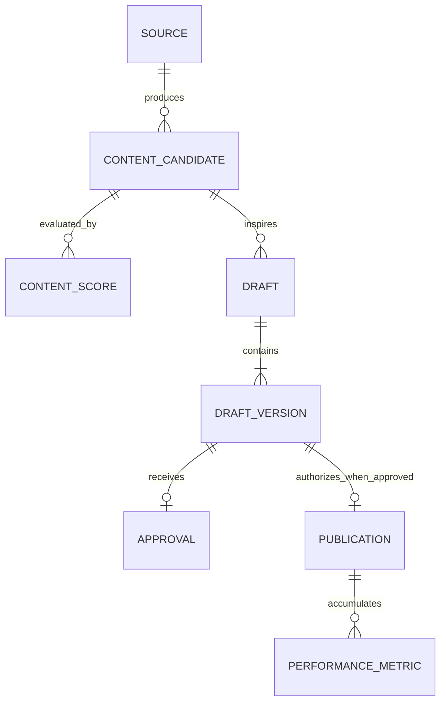

# Data Model

## Relationships

`Approved DraftVersion 1 → 0..1 Publication` is a business invariant enforced through a unique idempotency key. A non-approved version has no publication.

## Entities

### Source

A retrievable origin and its normalized content: type, original/canonical URL, title, author, timestamps, language, content hash, and extracted text. Source metadata is evidence, not authorization.

### ContentCandidate

A potentially useful editorial item linked to a source. It records discovery, summary, topics, language, hash, and lifecycle state. Canonical URL and hash support deduplication.

### ContentScore

A versioned evaluation of one candidate across relevance, brand alignment, audience value, novelty, authority, and opinion potential. It records an explanation, recommended pillar, and format. Scores are evidence for deterministic selection, not lifecycle authority.

### Draft

A stable editorial identity tied to a candidate. It groups immutable revisions.

### DraftVersion

The exact text shown for review, with version number, structured components, source references, factual claims, tone, content pillar, generation/model provenance, and status. Editing creates a new version; it never mutates an approved version.

### Approval

An authenticated human decision for one draft ID and version: `APPROVE`, `REVISE`, or `REJECT`, plus reviewer, time, and comments. An approval does not transfer across versions and cannot be authored by an LLM.

### Publication

One externally visible attempt/result tied to an `APPROVE` record. It stores a unique idempotency key, attempt identity, platform post ID on success, timestamps, and sanitized failure data.

### PerformanceMetric

A permitted platform metric associated with a publication and observation window, such as impressions or reactions where the API allows it. It records retrieval time and must not silently rewrite policy.

## Integrity constraints

- IDs are stable and globally unique within their entity type.
- Source/candidate content hashes use SHA-256 of a documented canonical representation.
- Draft versions are positive, monotonic integers and immutable after creation.
- At most one valid human decision exists per displayed draft version; a later revision uses a new version.
- Only `APPROVE` can be referenced by a publication.
- A successful idempotency key is never retried as a new publication.
- Timestamps are RFC 3339 UTC values at storage boundaries; presentation may use `America/Lima`.
- Deletion/retention rules must preserve the minimum audit trail required to explain publication while limiting personal data.

## Storage note

The logical model does not mandate a database. Google Sheets or n8n Data Tables may serve low-concurrency records. The approval/publication boundary requires uniqueness and atomic state guarantees; PostgreSQL or another transactional mechanism should be selected if simpler stores cannot provide them reliably.
