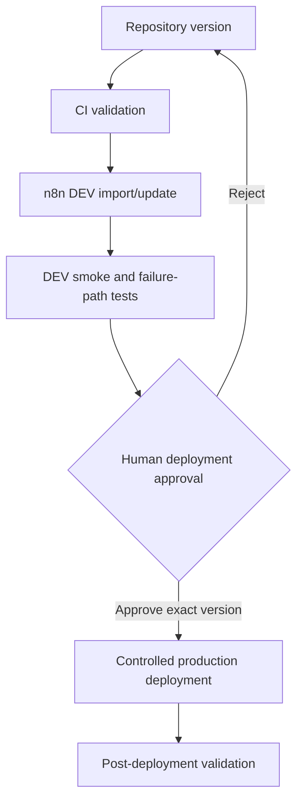

# Deployment Strategy

No deployment automation or production change is implemented in Phase 0. This document defines the target control flow.

AI agents must not unilaterally deploy to PROD. A pull-request merge is necessary but does not itself authorize deployment.

## Intended release record

A future deployment should record:

- repository commit SHA and workflow export checksums;
- DEV workflow IDs and smoke-test evidence;
- PROD target identifiers without credentials;
- human approver and approval time;
- previous deployable version;
- deployment result and post-deployment checks.

## Pre-deployment gate

1. CI passes on the exact commit.
2. Exported workflows were built/updated with current official n8n skills and validated in DEV.
3. Success, invalid-input, retry, duplicate, and human-approval rejection paths pass.
4. Credentials and endpoint mappings are environment-specific and least-privileged.
5. The owner approves the exact version and maintenance window.
6. A previous verified export is available for rollback.

## Rollback concept

- Retain the previous sanitized workflow export and its deployed workflow version.
- Stop or isolate new triggers when continuing execution could duplicate external side effects.
- Restore the prior known-good definition through the controlled deployment path.
- Validate workflow activation and critical paths after rollback.
- Reconcile in-flight publication attempts before retrying; never assume a timed-out LinkedIn call failed.
- Record the rollback, result, and follow-up action.
