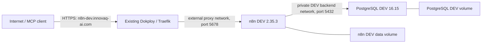

# Isolated n8n DEV

This directory defines the repository's isolated n8n DEV runtime. It is not a production deployment definition and must never be pointed at, connected to, or populated from production n8n.

No deployment has been performed as part of Issue #1. The stack starts empty: no workflows, no Telegram/LinkedIn/Gmail credentials, and instance-level MCP access disabled.

## Pinned images

- `docker.n8n.io/n8nio/n8n:2.35.3` — exact stable n8n release. On 2026-08-18, the official [GitHub release](https://github.com/n8n-io/n8n/releases/tag/n8n%402.35.3) was non-prerelease and both the official npm `stable` and `latest` dist-tags resolved to `2.35.3`. Do not replace it with `latest`, `beta`, `rc`, or another floating tag.
- `postgres:16.15-alpine3.24` — exact official PostgreSQL container tag for the isolated DEV database.

Review release notes and test a version change in DEV before updating either image. Never update the image tag during an unrelated deployment.

## Architecture



The PostgreSQL service is attached only to the internal `n8n_dev_backend` network. n8n is the only service attached to both that private network and the existing external Traefik network. No host port is published. The volume and private-network names are derived from the DEV-only `COMPOSE_PROJECT_NAME`, preventing accidental reuse of production resources.

This is V1 single-main-process mode: `EXECUTIONS_MODE=regular`, no Redis, no queue workers, and no webhook workers. n8n may use its built-in internal task runner for Code-node execution; that is not queue mode and does not add a separate container.

## Required environment variables

Create `infra/n8n-dev/.env` from `.env.example`. The repository ignores populated `.env` files. Keep the file owned by the deployment account with mode `0600`.

| Variable                           | Required value or rule                                                       | Purpose                                                                                     |
| ---------------------------------- | ---------------------------------------------------------------------------- | ------------------------------------------------------------------------------------------- |
| `COMPOSE_PROJECT_NAME`             | `linkedin-content-engine-n8n-dev`                                            | Gives networks, volumes, and Compose resources a DEV-only prefix.                           |
| `TRAEFIK_NETWORK`                  | Existing external Traefik network; normally `dokploy-network`                | Lets Traefik reach only the n8n container. Confirm it before deployment.                    |
| `TRAEFIK_CERT_RESOLVER`            | Existing resolver; normally `letsencrypt`                                    | Requests the DEV hostname certificate without changing Traefik itself.                      |
| `N8N_HOST`                         | `n8n-dev.innovaq-ai.com`                                                     | Canonical editor, webhook, and MCP hostname.                                                |
| `N8N_PROXY_HOPS`                   | `1` for direct Traefik; adjust only if another trusted proxy exists          | Makes n8n interpret forwarded client information correctly.                                 |
| `POSTGRES_DB`                      | `n8n_dev` or another DEV-only name                                           | Dedicated database name.                                                                    |
| `POSTGRES_USER`                    | `n8n_dev` or another DEV-only role                                           | Dedicated database role.                                                                    |
| `POSTGRES_PASSWORD`                | New random DEV-only value                                                    | Database authentication. Never reuse a production password.                                 |
| `N8N_ENCRYPTION_KEY`               | New random DEV-only value; retain securely for the lifetime of this DEV data | Encrypts n8n credentials at rest. Never copy or rotate in the same operation as deployment. |
| `N8N_INSTANCE_OWNER_EMAIL`         | DEV owner email                                                              | Pre-provisions the owner and prevents a public first-run claim screen.                      |
| `N8N_INSTANCE_OWNER_FIRST_NAME`    | DEV owner first name                                                         | Owner identity.                                                                             |
| `N8N_INSTANCE_OWNER_LAST_NAME`     | DEV owner last name                                                          | Owner identity.                                                                             |
| `N8N_INSTANCE_OWNER_PASSWORD_HASH` | DEV-only bcrypt hash, single-quoted in `.env`                                | Owner login. Plaintext is invalid and must never be stored.                                 |
| `N8N_MCP_ACCESS_ENABLED`           | `false` initially                                                            | Instance MCP remains off until a separate reviewed enablement step.                         |
| `EXECUTIONS_DATA_MAX_AGE`          | Default `168` hours                                                          | Bounds execution-data retention.                                                            |
| `EXECUTIONS_DATA_PRUNE_MAX_COUNT`  | Default `1000`                                                               | Bounds retained execution count.                                                            |
| `N8N_MEMORY_LIMIT`                 | Default `1g`                                                                 | Caps n8n memory consumption on the shared VPS.                                              |
| `N8N_CPU_LIMIT`                    | Default `1.00`                                                               | Caps n8n CPU consumption.                                                                   |
| `POSTGRES_MEMORY_LIMIT`            | Default `512m`                                                               | Caps PostgreSQL memory consumption.                                                         |
| `POSTGRES_CPU_LIMIT`               | Default `0.50`                                                               | Caps PostgreSQL CPU consumption.                                                            |

The Compose file also fixes these non-secret settings: PostgreSQL backend coordinates, `America/Lima` for both `GENERIC_TIMEZONE` and `TZ`, HTTPS public URLs, secure cookies, environment access blocked in nodes, regular execution mode, JSON console logging, bounded Docker logs, telemetry/personalization/templates/version checks disabled, community-package installation disabled, and MCP managed by environment.

## Prepare the DEV environment file

Run these commands only on the intended DEV deployment host or in an approved secret-management workflow. They create new values; they do not read production state.

```bash
cd /opt/linkedin-content-engine/infra/n8n-dev
umask 077
cp .env.example .env
chmod 600 .env

postgres_password="$(openssl rand -hex 32)"
n8n_encryption_key="$(openssl rand -hex 32)"
read -r -s -p "New n8n DEV owner password: " n8n_owner_password
printf '\n'
n8n_owner_hash="$(printf '%s' "$n8n_owner_password" | docker run --rm -i httpd:2.4.68-alpine3.24 htpasswd -niBC 12 "" | tr -d ':\r\n')"
unset n8n_owner_password

sed -i "s/^POSTGRES_PASSWORD=.*/POSTGRES_PASSWORD=$postgres_password/" .env
sed -i "s/^N8N_ENCRYPTION_KEY=.*/N8N_ENCRYPTION_KEY=$n8n_encryption_key/" .env
sed -i "s|^N8N_INSTANCE_OWNER_PASSWORD_HASH=.*|N8N_INSTANCE_OWNER_PASSWORD_HASH='$n8n_owner_hash'|" .env
unset postgres_password n8n_encryption_key n8n_owner_hash
```

Edit the four owner identity fields and verify the infrastructure names. Do not paste secrets into an issue, pull request, terminal transcript, or Dokploy build log. The bcrypt value must remain single-quoted in `.env` so Compose preserves its `$` characters.

## Pre-deployment review

Do not deploy until this change has been reviewed and merged through the repository's normal pull-request flow. On the VPS, the following checks are read-only and do not inspect any n8n instance:

```bash
cd /opt/linkedin-content-engine/infra/n8n-dev
test "$(stat -c '%a' .env)" = "600"
docker network inspect dokploy-network >/dev/null
docker compose --env-file .env config --quiet
docker compose --env-file .env config --images
```

Before starting containers, confirm:

1. DNS for `n8n-dev.innovaq-ai.com` points to the intended VPS.
2. The external network and certificate-resolver names match the existing Dokploy/Traefik installation.
3. No Dokploy domain entry also injects a second router for the same service. This Compose file uses manual Traefik labels; choose one routing method, not both.
4. The VPS has capacity for the configured 1 CPU/1 GiB n8n ceiling and 0.5 CPU/512 MiB PostgreSQL ceiling, plus image, volume, and log growth.
5. `.env` contains only new DEV values and `N8N_MCP_ACCESS_ENABLED=false`.

## Exact deployment commands (after review only)

These commands create only this DEV stack. They do not restart, update, inspect, or modify production n8n or the Traefik/Dokploy containers.

```bash
cd /opt/linkedin-content-engine/infra/n8n-dev
docker compose --env-file .env config --quiet
docker compose --env-file .env pull
docker compose --env-file .env up -d
docker compose --env-file .env ps
docker compose --env-file .env logs --tail=100 postgres n8n
curl --fail --silent --show-error https://n8n-dev.innovaq-ai.com/healthz
```

`docker compose up -d` may create only these named resources:

- `${COMPOSE_PROJECT_NAME}-backend`
- `${COMPOSE_PROJECT_NAME}-n8n-data`
- `${COMPOSE_PROJECT_NAME}-postgres-data`
- the two Compose service containers

It joins, but does not create or alter, `${TRAEFIK_NETWORK}`. Never add `--remove-orphans`: if the Compose project name is accidentally shared, that flag can remove unrelated containers.

## MCP and inactive-workflow policy

The image supports n8n's instance-level MCP server and advertises it using `N8N_MCP_BASE_URL=https://n8n-dev.innovaq-ai.com`. The default remains disabled because both `N8N_MCP_MANAGED_BY_ENV=true` and `N8N_MCP_ACCESS_ENABLED=false` are applied at every startup.

### n8n 2.35.3 environment-lock compatibility

The environment-managed design was verified against the exact `n8n@2.35.3` source, not inferred from current `master` or release notes:

- [Issue #34144](https://github.com/n8n-io/n8n/issues/34144) reported that `N8N_MCP_MANAGED_BY_ENV=true` incorrectly disabled the Allowed Redirect URIs controls.
- [PR #34184](https://github.com/n8n-io/n8n/pull/34184) fixed the bug in commit [`64318a810df1cc7fe27470db9f9b1930c6d12e20`](https://github.com/n8n-io/n8n/commit/64318a810df1cc7fe27470db9f9b1930c6d12e20) by separating redirect-URI editing permission from the env-managed MCP toggle. The commit includes a regression test where an admin has `mcpManagedByEnv=true`: the MCP toggle is disabled while the redirect-URI input and Save button remain enabled.
- The exact `n8n@2.35.3` tag resolves to release commit [`0dccd14a44a4e590b8641a12a95c9c76f8d525dc`](https://github.com/n8n-io/n8n/commit/0dccd14a44a4e590b8641a12a95c9c76f8d525dc). GitHub's commit comparison reports the fix commit as an ancestor of that tag with no divergence.
- In the tagged `SettingsMCPView.vue`, [`mcpManagedByEnv` remains part of `canToggleMCP`](https://github.com/n8n-io/n8n/blob/n8n%402.35.3/packages/frontend/editor-ui/src/features/ai/mcpAccess/SettingsMCPView.vue#L52-L55) for the enable/disable control, but inside the MCP-enabled view the [Allowed Callback URLs row](https://github.com/n8n-io/n8n/blob/n8n%402.35.3/packages/frontend/editor-ui/src/features/ai/mcpAccess/SettingsMCPView.vue#L304-L315) is additionally gated only by the administrator's `mcp:manage` permission. The row opens `McpAllowedCallbackUrlsDialog` without passing an env-lock or disabled property.
- In the [tagged callback dialog](https://github.com/n8n-io/n8n/blob/n8n%402.35.3/packages/frontend/editor-ui/src/features/ai/mcpAccess/components/McpAllowedCallbackUrlsDialog.vue#L130-L175), the URL input has no env-managed disable condition and the Save button depends only on URL validation and loading state. The [tagged dialog tests](https://github.com/n8n-io/n8n/blob/n8n%402.35.3/packages/frontend/editor-ui/src/features/ai/mcpAccess/components/McpAllowedCallbackUrlsDialog.test.ts#L21-L60) assert that valid selections are editable and saveable.

Conclusion: Issue #34144 is fixed in the pinned version. Keep `N8N_MCP_MANAGED_BY_ENV=true`; it locks the MCP access toggle to the reviewed environment value without preventing an administrator from editing Allowed Redirect URIs after MCP access is enabled.

After deployment and a separate security review:

1. Sign in as the pre-provisioned DEV owner and confirm the instance has no connected MCP clients, workflows, or third-party credentials. Keep MCP disabled while making this initial check.
2. After explicit approval for the MCP setup step, change only `N8N_MCP_ACCESS_ENABLED=true` in the host's protected `.env`, then run `docker compose --env-file .env up -d n8n`.
3. Immediately open **Settings > Instance-level MCP > OAuth settings > Allowed Redirect URIs**, select the trusted-URLs mode, and save the exact approved client callback URLs. In n8n 2.35.3 this section is visible only while MCP access is enabled. Do not connect a client until the allowlist is saved.
4. Prefer OAuth and grant the coding agent only the read and safe workflow-edit capabilities required by Issue #1. Do not grant production access or share an all-purpose token.
5. Connect the client to the DEV URL, verify instance identity and capabilities without printing credentials, and create only a clearly named non-production test artifact.
6. Keep every created/imported workflow unpublished (inactive). Do not call `publish_workflow`, enable a trigger, or add Telegram, LinkedIn, or Gmail credentials.
7. Retrieve the test artifact again, compare its persisted definition with the intended safe draft, record sanitized evidence, and then remove or archive it as approved.

Those live MCP steps are intentionally not performed by this infrastructure-only change.

To disable MCP, set `N8N_MCP_ACCESS_ENABLED=false` and re-run `docker compose --env-file .env up -d n8n`. Then revoke connected OAuth clients in **Settings > Instance-level MCP**. Disabling at the environment layer is reapplied on every restart.

## Operations and removal

Routine status and logs:

```bash
cd /opt/linkedin-content-engine/infra/n8n-dev
docker compose --env-file .env ps
docker compose --env-file .env logs --tail=200 postgres n8n
```

Stop without deleting data:

```bash
docker compose --env-file .env down
```

`docker compose down --volumes` permanently deletes the DEV n8n and PostgreSQL volumes. Run it only with explicit approval, after verifying the Compose project and backup/retention requirement. Never use broad Docker prune commands on the shared VPS.

## Risks to the existing VPS

- **Resource contention:** image pulls, PostgreSQL, executions, and retained data consume shared CPU, memory, disk, and I/O. Limits and log rotation reduce but do not eliminate this risk; Docker volumes can still fill the disk.
- **Routing collision:** a duplicate hostname/router label or an incorrect Traefik network/certificate-resolver name can cause routing or certificate failures. The router/service names are DEV-specific, and no host port is published.
- **Proxy trust mismatch:** `N8N_PROXY_HOPS=1` is correct only when Traefik is the sole trusted proxy. A CDN or extra proxy requires deliberate recalculation; too many trusted hops can allow spoofed forwarded headers.
- **First-owner exposure:** an empty public n8n instance can be claimed. This stack requires a pre-provisioned owner and bcrypt hash before it can render successfully.
- **Secret loss or reuse:** losing/changing `N8N_ENCRYPTION_KEY` makes stored DEV credentials unreadable; reusing the production key destroys environment separation. Back up the DEV key securely outside Git.
- **Shared proxy network visibility:** n8n must join the external Traefik network, so containers already on that network may reach its port 5678. PostgreSQL remains isolated on the internal backend network.
- **Outbound side effects:** credentials or active workflows added later could call external providers. The empty instance has no Telegram, LinkedIn, or Gmail credentials, MCP is off, and the operating rule is that workflows remain inactive until explicitly reviewed.
- **Image change:** even exact tags should be pulled and reviewed deliberately. Do not run unattended image updaters against this stack.
- **Destructive operator commands:** `down --volumes`, Docker prune operations, or reusing the project name can delete or collide with data. The documented deployment path avoids them.
